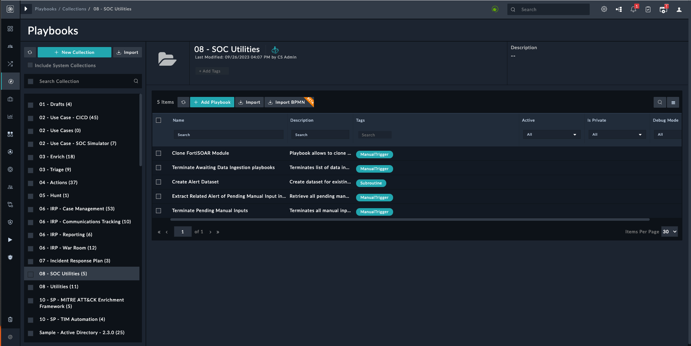
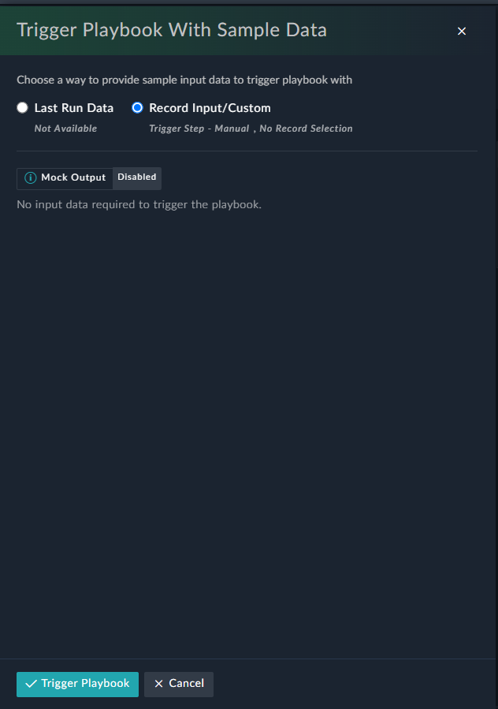
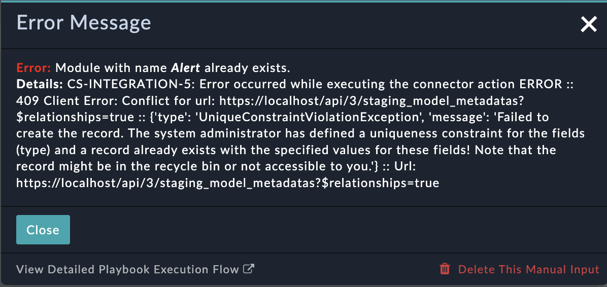
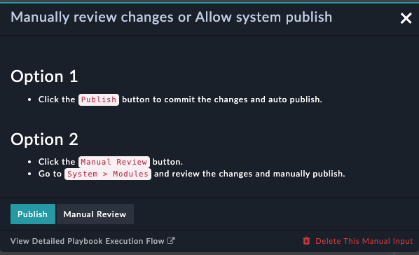
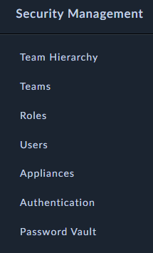
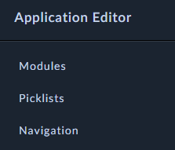
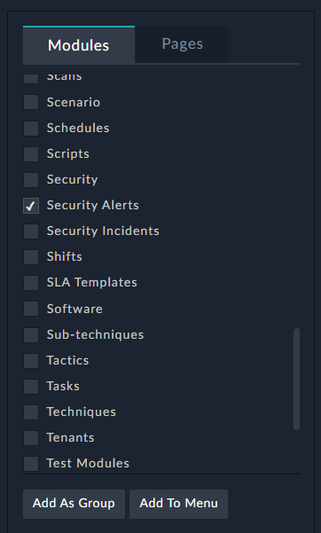
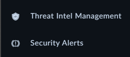

| [Home](../README.md) |
|----------------------|

# Usage
First, refer to the installation and [setup guide](setup.md) to get started. Use the example(s) found below to decide what provisioning options are avaialble out of the box.

## Utility Playbook &mdash; Clone FortiSOAR Module
This playbook gives you the ability to clone a FortiSOAR module. Currently there is no UI function to clone a module so this playbook was created to solve that need.

## New Module Creation:

1. Navigate to **Playbooks** -> **08 - SOC Utilities** collection

2. Click the  **Clone FortiSOAR Module** playbook to open it
3. Click the play button at the top right

4. Click **Trigger Playbook** button at the bottom left

5. From the pop up box, select the module you want to clone from, and provide the name of what the new module should be called. For this example we are selecting **Alerts** as the "Old Module", and the name **Security Alerts** as the New Module

6. Click the **Next** button
> **Note:** If Module with same name already exists. A popup with error message appears.

7. This may take 10-15 seconds to run. After you will see a popup with two options.

 - Option 1: If you are ready to publish the changed click the **Publish** button
 - Option 2: click the **Manual Review** button. you will need to manually publish by navigating the Modules section in the System Settings

8. The publish will take 1-2 minutes.

## Module Permission

1.  Navigate to System Settings by clicking the Gear icon at the top right

2.   Click the **Roles** section from the left navigation pane.

3.   Click the **Full App Permissions** Role, or whichever role you want to assign the permissions for the new module

4.   Scroll until you find the new module name (Security Alerts in this example), and check all of the permission boxes as necessary.

5.   Click **Save** at the bottom left

> **Note:** Repeat steps 4 and 5 for adding permissions on other roles if needed

> **Caution:** If you need playbooks to create records in this module, make sure the playbook appliance has the CRUD permissions necessary to access the module

6.   Navigate to the Navigation section of the settings

7.  Find the new module in the Modules box and check the box.

8. Click **Add to Menu**

9. Scroll to the very bottom of the page. You can then optionally change the icon of the module using the pencil icon to the right of the row.

10.  (Optional) Drag the row to where you want to the module displayed.

11.  Click **Save** at the bottom left.
12.  Refresh the page using F5 on the keyboard, or the refresh button on the browser.

The new module is now visible in the navigation pane.

| [Installation](./setup.md#installation) | [Configuration](./setup.md#configuration) | [Contents](./contents.md) |
|-----------------------------------------|-------------------------------------------|---------------------------|
